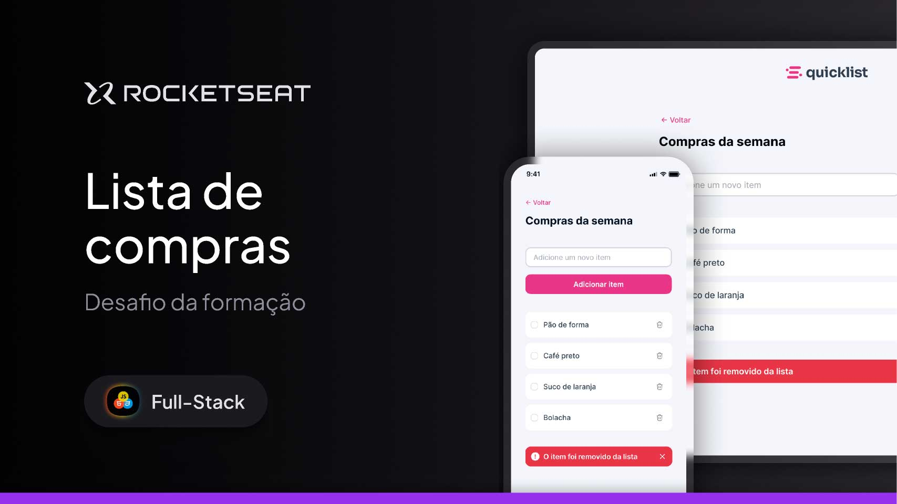

<h1 align="center">📝 TarefApp</h1>

  Simple and intuitive task management app, developed as part of the <strong>Rocketseat Challenge</strong> and recently redesigned with a new identity.

  <a href="#-about-the-project">About</a>&nbsp;&nbsp;&nbsp;|&nbsp;&nbsp;&nbsp;
  <a href="#-challenges-in-this-stage">New Challenges in this Stage</a>&nbsp;&nbsp;&nbsp;|&nbsp;&nbsp;&nbsp;
  <a href="#-technologies">Technologies</a>&nbsp;&nbsp;&nbsp;|&nbsp;&nbsp;&nbsp;
  <a href="#-layout-and-branding">Layout & Branding</a>&nbsp;&nbsp;&nbsp;|&nbsp;&nbsp;&nbsp;
  <a href="#memo-license">License</a>

  

 

  

---

## 🚀 About the Project

**TarefApp** is a simple daily task list where users can:

- Add new tasks
- Mark tasks as completed (with visual strikethrough)
- Remove tasks (with a toast notification for feedback)
- Have their list saved in **localStorage**, keeping data between sessions

Originally started as a shopping list app, this project was refactored and rebranded as a daily task manager, gaining a new visual identity, a refreshed color palette, and a broader purpose.

---

## ✨ Challenges in this Stage

During this redesign phase, the following technical and design challenges were addressed:

✅ Refactored HTML/CSS structure for better semantics and scalability  
✅ New visual identity and color palette (moving away from the "shopping" theme)  
✅ Full branding redesign: new name (**TarefApp**) and slogan (*"Where dreams become tasks"*)  
✅ Custom **toast notification component** (for deletion feedback)  
✅ Improved input validation (preventing empty, symbol-only, or number-only inputs)  
✅ Better accessibility and usability (auto-focusing the input after each task is added)  
✅ Code cleanup and logic improvements for readability and maintenance

This was a great opportunity to practice not just coding, but also **UI design decisions**, **project branding**, and **user experience enhancements**.

---

## 🛠 Technologies

This project was built with:

- HTML
- CSS
- JavaScript (ES6+)
- DOM Manipulation
- LocalStorage API
- Git & GitHub
- Figma (for layout and branding references)
- Responsive Design techniques

---

## 🔗 Live Project

➡️ [Access the live version](https://andreskull2.github.io/tarefApp/)  
🎓 [Rocketseat JavaScript Course](https://www.rocketseat.com.br/formacao/javascript)

---

## 🎨 Layout and Branding

This new version was redesigned by me, starting from the original layout by **Thiele Santana** ([Figma Community](https://www.figma.com/community/file/1397279978314668489)).  
I customized the color palette, created a new logo, renamed the app to **TarefApp**, and added a motivational slogan (*"Where dreams become tasks"*).

The layout was adapted directly during development to create a more playful and personal visual identity, with responsive behavior for both mobile and desktop.

---

## :memo: License

This project is licensed under the **MIT License**.  
Feel free to use it for study, inspiration, or as a base for your own projects.

---

Made with ♥ by **@andreskull2** 🚀  
:wave: [Join the Rocketseat community!](https://discord.gg/rocketseat)
